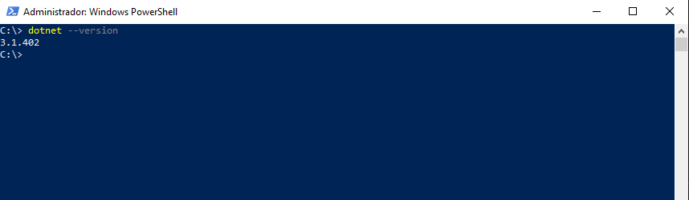
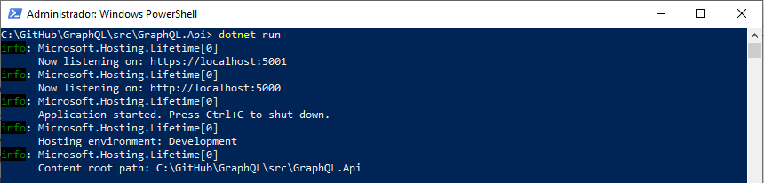
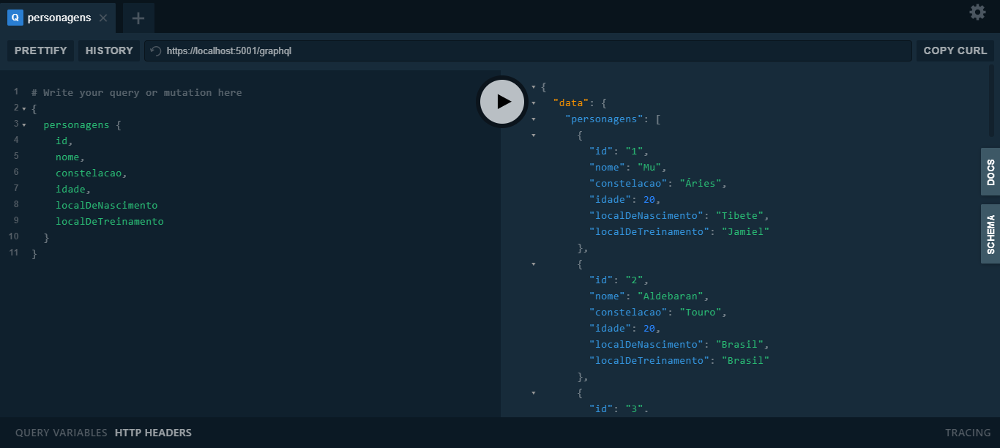

# GraphQL

> Exemplo de uma API baseada em GraphQL, utilizando C# e .NET Core 3.1.

## O que é?

- Contém a estrutura básica de uma API em GraphQL.

- Como exemplo, permite consultar os dados da entidade **PersonagemModel**, que são baseados na série **Os Cavaleiros do Zodíaco**, de Masami Kurumada;

- Possui a seguinte estrutura:

    **GraphQL.Api** => Responsável por configurar e disponibilizar a API e o **GraphQL Playground**.

    **GraphQL.Infra.CrossCutting** => Responsável pela configuração da injeção de dependência. Camada intermediária entre API e Infra.Data.

    **GraphQL.Infra.Data** => Contém a estrutura do GraphQL (schema, query e types), além da classe **PersonagemRepository**, que dá acesso aos dados.
	
	**GraphQL.Models** => Contém o modelo de dados deste exemplo.

## Requisitos

- É necessário ter instalada a versão 3.1 ou superior do .NET Core. Caso seja necessário, faça o download [aqui](https://dotnet.microsoft.com/download/dotnet-core).

- Utilizando o terminal de sua preferência, confirme se a instalação foi concluída com sucesso:

    

## Como utilizar?

- Acesse o diretório *\src\GraphQL.Api*, pois é lá que se encontra o arquivo *GraphQL.Api.csproj*. Execute o comando para iniciar o projeto e subir a API localmente:

    ```
    dotnet run
    ```

    

- No seu navegador preferido, verifique se a página do **GraphQL Playground** está disponível através deste endereço: https://localhost:5001/ui/playground.

    

- Pronto. Agora é só fazer os testes utilizando a sintaxe do GraphQL! Segue um exemplo:

    ```
    {
      personagens {
        id,
        nome,
        constelacao,
        idade,
        localDeNascimento
        localDeTreinamento
      }
    }
    ```

## Referências

[GraphQL Foundation](https://graphql.org/)

[GraphQL para .NET](https://github.com/graphql-dotnet/graphql-dotnet)